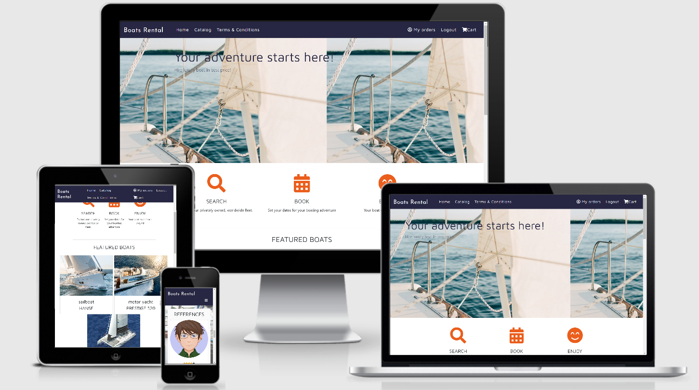

# Aleksandra Kula - Boat Rental

Code Institute, Full Stack Frameworks with Django 2019/2020

# Introduction

"Boat rental" service is a Django application created for educational purpose that will be hosted online. As an educational exercise the goal is to implement full stack application using Python and Django framework, with well styled interactive frontend featuring data storage, search capabilities, account management, autohization and authentication, checkout and transaction history. 

## Project purpose

The purpose of application is to let people search for luxurious boats for rent, check their availability, make a booking for selected dates and finalize the transaction with a payment. 
Customers are able to register an account in a service, browse the boat catalog or use search functionality to help them find exactly the boat they are looking for. 
Customers can view details and pictures of boats they are interested in and if they find one they would like and it is available they can place it in a basket and finalize transaction by processing the credit card payment of the contents of their basket. 
Each customer can view history of their transactions.

## Demo

# Programming language and libraries

For the purpose of creating boat rental service following programming languaes and libraries were used: 

**Python (3.7.4)**
Scripting language available on multiple platforms that is used for writing backend code (data management, application configuration, interaction with operating system, environment variables and files)

**Django**
Modular web application framework written in Python, provides application structure and common components like authentication and authorization. 

**Boto3**
Amazon Web Services (AWS Cloud) client used for interation with files stored in S3 bucket (Simple Storage Service)

**Javascript**
Scripting language running in web browsers. It was used in projects for implementing inteactive frontend components, mainly the search component, though in current project it's use is rather sparse. Javascript (.js) files are stored as static files in folder static/js.
Integration with Stripe payments is done through stripe javascript client.

**jQuery**
Javascript library simplifying interaction with html elements, executing ajax queries and providing utility functions. jQuery is also required by some interactive bootstrap components. In the project jQuery was used to implement part of the search component. 

**CSS**
Web styling language used to apply styles to html document. All css is stored in a single, shared file style.css stored in static files css folder. 

**Bootstrap**
Library providing responsive, styled web components. Used on most of the templates and tuned with custom stylesheet.  

**Powershell**
CLI scripting language available on Microsoft Windows operating system by default. In the project it was used for minor scripting tasks like automating running linter and autopep against multiple .py files

**Stripe**

Payments provider and javascript library providing easy to use payment API, that abstract and hides underlying API calls to Stripe backend services.

# Tools used

Following tools, were used during development of the project: 

- `Balsamiq mockups` were used in the initial project stage for creating mockups of the application. It helped in the initial planning of the site functionality as well as to create initial layout of the site and required templates for the MVP of the project.
 
- `Visual Studio Code` is a text editor used in the development process. I chose this editor because of its lightweight nature, ease of installation and small installation size, good support for frontend technologies like javascript and css (which were used to create editor itself) and also its extensibility through plugins with high quality plugin for Python created by Microsoft itself.
  
- `Python plugin for Visual Studio Code (by Microsoft)` was used for writing python (.py) files in the project. Plugin is easy to install through extension mechanism that downloads and installs plugin with just a single click. Python plugin provides useful facilities like syntax coloring, IntelliSense, linting, debugging, code navigation, code formatting, Jupyter notebook support, refactoring, variable explorer, test explorer, code snippets and more. 

- `pylint` is a standalone Python linter that i used to scan code and detect potential coding or formatting issues. In order to use the tool after installation i have added a folder to PATH environment variable ({USER_FOLDER}\AppData\Roaming\Python\Python37\Scripts). By adding the new entry to the PATH variable i made the tool available by just typing `pylint` in the terminal window.
  
- `pycodestyle` (formerly called pep8) is a Python style guide checker, which i installed as a PyPI PyPI package tp validate code conformance to pep8 standard. 
  
- `autopep8` is another PyPI package that I used, it automatically formats Python code to conform to the PEP 8 style guide. It uses the pycodestyle utility to determine what parts of the code needs to be formatted. autopep8 is capable of fixing most of the formatting issues that can be reported by pycodestyle. I used level 2 aggressive formatting which gave easy to read pep8 conformat formatted code (autopep8 --in-place --aggressive --aggressive <filename>). In order to make it easy to use i further automated running autopep8 with powershell script iterating through all the files in project and automatically formatting all unformatted files. The script is presented below:
ls . -filter *.py -recurse | % { autopep8 --in-place --aggressive --aggressive $_.fullname }
  
- `PostgreSQL windows client` I have installed as part of Windows PostgreSQL database installation. I used the database client to inspect the data being written to database during project development and leatning about Django data models. It also came very handy while testing the application to either create or clear test data from the database. 

# Payments
- Stripe

# Authentication and authorization

Application is using authentication and authorization mechanisms in order to identify users and provide relevant contents accoring to their identity and access levels. There are application pages that can be browsed without having an account and having to log in, like homepage or boat catalog. Then there are pages that require user to be logged in to see the content related to their account like for example profile page or checkout. There is also and admin page that requires user to have administrative priviledges. 
Most of the authentication and authorization is done by enabling and customizing existing Django mechanisms ("accounts.backends.EmailAuth", "django.contrib.auth.backends.ModelBackend"). 
Sending emails is using another Django mechanism ("django.core.mail.backends.smtp.EmailBackend") and is configured to utilize gmail smtp gateway. 
In addition to configuring existing mechanisms in templates/registration folder i have created customized templates that override default django templates and provide look and feel of password related emails consistent with the rest of the application. 

# Django application structure

Django application consists of multiple reusable components that are in Django nomenclature also called applications. Django is pluggable, extensible and provides multiple applications out of the box. To implement mu project I used following default Django applications: 

- django.contrib.admin
- django.contrib.auth
- django.contrib.contenttypes
- django.contrib.sessions
- django.contrib.messages
- django.contrib.staticfiles

I have added some applications not delivered with default Django installation. For the purpose of working with bootstrap and especially forms presented with bootstrap styles i used: 

- django_forms_bootstrap
- crispy_forms

And in order to configure and use S3 bucket i used application: 
- storages

I have also created some applications for handling different parts of the solution, which are described below: 

|Application name | Purpose |
|homepage|The main page of application|
|accounts|Handling user account registration, profile and log-in / log-out|
|boats|Boat catalog, boats data and availability for calendar view|
|reviews|Site reviews listing and loading|
|comments|User comments on provided boats|
|cart|Handling user cart management|
|checkout|Selected products checkout, stripe integration for card processing|

# API
|Pattern|View|Name|Application|Description|
|-------|----|----|-----------|-----------|
|/|index|index|boat_rental|Loads the welcome view of the site|
|/admin|-|-|boat_rental|Loads the authenticated Django admin panel|
|/media/(?P<path>.*)$|-|-|boat_rental|Loads requested file from media folder stored in S3|
|/checkout|checkout|checkout|checkout|Preents the checkout view|
|/boats|find_boats|boats|boats|Loads and filters boats for the catalog|
|/boats/(?P<boat_id>[0-9]+)|boat_details|boat_details|boats|Loads and presents details of selected boat|
|/boatsa/vailability/(?P<boat_id>[0-9]+)/(?P<year>[0-9]+)/(?P<month>[0-9]+)|boat_availability|boat_availability|boats|Loads the boat availability for selected month, it is the only endpoint serving just JSON data, not a view|
|/cart|view_cart|view_cart|cart|Presents user cart view|
|/cart/add/(?P<id>\d+)|add_to_cart|add_to_cart|cart|Adds item to cart|
|/cart/remove/(?P<id>\d+)/(?P<subid>\d+)|remove_from_cart|remove_from_cart|cart|Removes item from cart|
|/cart/adjust/(?P<id>\d+)|adjust_cart|adjust_cart|cart|Adjusts / changes quantity in user cart|
|/accounts/logout|logout|logout|accounts|Logs user out and redirects to index page|
|/accounts/login|login|login|accounts|Presents user with login form|
|/accounts/register|registration|registration|accounts|Presents non-authenticated user with registration form|
|/accounts/profile|user_profile|profile|accounts|Presents authenticated user with his profile page containing all purchases to date|
|/accounts/password-reset|password_reset|password_reset|accounts|Initiates password reset procedure|
|/accounts/password-reset/done|password_reset_done|password_reset_done|accounts|Presents information that password resent was successful|
|/accounts/password-reset/(?P<uidb64>[0-9A-Za-z]+)-(?P<token>.+)/|password_reset_confirm|password_reset_confirm|accounts|If token matches one saved to a databse during password reset procedure initiation, it resets the password|
|/accounts/password-reset/complete|password_reset_complete|password_reset_complete|accounts|Presents screen confirming that password reset email was sent|

# Testing 

Most fo the testing was done manually to test part of application flows from user perspective. By the end of development a full test cycle was done that included account registration, log-in / out, browsing pages on multiple browsers (Microsoft Edge, Google Chrome, Mozilla Firefox, iPad, iPhone, Samsung Galaxy) and looking for visual issues when changing devices and scale of the screens. Test cycle included browsing the catalog, adding / removing from cart, and finally the successful and unsuccessful checkout process. 

In addition to manual testing I have included few automated tests of three types available in Django. 
Those types are `Form tests` `Model tests` and `Views tests`. Forms test validate if form fields are configured properly and properly initialized. Thanks to these tests an issue where not all months in dropdown were populated was found. Model focus on how models are defined and how their fields are configured, it also tests basic CRUD operations on model instances. The last, view tests are testing business logic that gets data from requests in the backend, loads relevant data, processes it and sends data for rendering in the templates. 

In order to get a sense of how much testing was really done and how much is still left test coverage tools are being used. During the development process i used `Coverage.py` which i installed with PIP. It is and easy to use tool that quickly gives eye catching and easy to read reports with all the statistics included. In order to measure, collect, and report on code coverage i executed command `coverage manage.py test` which ran and created coverage data that then could be browsed in a terminal with command `coverage report`. Coverage.py can also export report in html form with command `coverage html` which creates `htmlcov` folder and puts html files file supporting javascripts and css for improving visual styles. The report can be browsed with default web browser by just opening file `./htmlcov/index.html`.

# Linting

Linting is the process of running a program that will analyse code for potential errors. It can be automated through tools and scripts. For some programming languages (including Python) tools fixing potential issues found by linter exist and are available to developers for free. Few tools used during development were described in `tools` section before. In Visual Studio code linting can be either run manually from terminal by invoking linter with parameters or it can be invoked from `run menu` accessible by pressing keys combination CTRL + SHIFT + P and then selecting option `Python: Run Linting`. Linting can also be enabled to be running constantly on each file being saved using option from the same `run menu` but with option `Python: Enable Linting`. 

# Deployment and hosting

Application code is stored in a public github repository specially created for the project (https://github.com/OlaQla/BoatRental). Thanks to using git (distributed version control system) and github (git hosting platform owned by Microsoft) it is easy to share the code, track changes in application logic and assets and if needed to revert unwanted changes. 

For the purpose of validating code on all code check-ins before it gets deployed and potentially something gets broken, In Travis CI there is a dedicated project configured (https://travis-ci.org/OlaQla/BoatRental) to run the tests and either allow or block the deployment. 
In code repository i have created a file .travis.yml that contains configuration instructing Travis how to build the project and instructs it to run included tests.
Travis also provides a successful / failing build badge that helps visually indicate if code stored in repository is in healthy state. 

Production version of application (http://boat-rental.herokuapp.com/) is hosted on a free tier of Heroku platform. In Heroku i have created dedicated project and connected it to code stored in github repository in CD (continuous delivery) fashion, what makes the most recent version of code to be deployed automatically after it's pushed to code repository and passes validation in Travis. 
In Heroku application is utilizing a Heroku managed PostgreSQL database which was the easiest way of attaching production database to hosted application. 
For the purpose of correctly building application for hosting in Heroku container i have installed python package django-heroku (v.0.3.1).
In settings.py i had to import django_heroku package and at the end of the file i have added an invocation of a django_heroku.settings function to correctly set application options for hosting.

Media files are stored in AWS S3 bucket. It is due to Heroku dynos storage not being persistent what would make uploaded media files to go away if application was to be scheduled in a different dyno which is in Heroku nomenclature type of a virtual machine. Heroku applications could be scheduled in different dynos after each deployment, when old application instance is removed and a new one is created. Free tier dynos are also not guaranteed to be active all the time and can be recycled and application scheduled on a different node when someone tries to access it. 
AWS S3 has a free tier that provided me with enough capacity to host the files i needed. 
In order to host media files in a folder in S3 bucket in a transparent way for the application i have created and custom storage for media files in custom_storages.py and plugged it in settings.py as a media file storage class.

Static files are hosted in the same S3 bucket as media files. The reason for hosting static files in S3 bucket are that it provides potentially better bandwidth and quicker response times due to being architected in a way to serve files efficiently, rather than running applications. 
To avoid clashing in the same bucket with media files, i have created a custom storage for static files (inheriting from S3Boto3Storage class) and configured it in settings.py. 
I found few issues when trying to push static files to the bucket. First issue was that when running manage.py collectstatic command i expected files to be uploaded to S3 storage, instead files were collected locally only and nothing was uploaded. I googled for potential solutions until i found a suggestion on stackoverflow (https://stackoverflow.com/questions/49742714/collecstatic-does-not-push-to-files-s3) that it might be related to open issue in django_heroku package (https://github.com/heroku/django-heroku/issues/25). After passing parameter `staticfiles=False` to django_herku.settings call the collectstatic started working as expected. 
Once files were uploaded i found the second issue that static files were not served correctly from S3 bucket, images were missing, there was not styling on a page and layout was broken due to browser nto being able to validate https certificate correctly. The issue appeared to be the name of the bucket, which contained `.` and broser was unable to identify which part of url is the domain name. Solution to this problem was to create a new bucket with dash, instead of dot in the name. 
After thatchange i could see in developer tools network tab that all the assets are loaded from S3 bucket correctly and they are being updated before every deployment of the application. 
 
# Limitations, further development

The purpose of project is educational and the functionality was planned in form of an MVP, what means a version of a project that if the smallest usable subset of the whole idea that the developer would be able to implement in designated timeframe. MVP for the boat rental project was to cover user registration, authentication and authorization, administrator panel, product catalog, cart and checkout and payments integration. All those components would allow users to go through the basic flow from account creation to successful renting of a selected boat and charging user credit card. 
In addition to that I have implemented site reviews and comments that are at the moment populated from admin panel only. Comments and reviews are loaded and visible to users but right now the site does not provide users ways to create new reviews and comments. This functionality is implemented in limited form because of time constraints, also the planned requirement was to allow for creating comments for a boat but user who is confirmed to have rented a boat and after the rental time have passed. The complexity of the feature and testing it made me make decision to provide it in MVP in limited version only. 
Another potential extension to the site would be to provide boats geographical location and searching boats by their locations. This feature was dropped in current release. 
Last and probably most complex to implement feature would be acquiring lock to a boat for a limited time while viewing it's availability of after putting it to basket to avoid concurrency issues if more than one person is trying to book the same boat at the same time or if a malicious user tries doing it using multiple browser windows or devices. The feature was decided to be too complex for the first release taking into account educational purpose of the project.

# Credits

images: 
https://unsplash.com/, 
https://pixabay.com/, 
https://www.pexels.com/

favicon:"https://icons8.com/icon/9317/sail-boat" Sail Boat icon by Icons8
  
** Purpose of this project is educational **